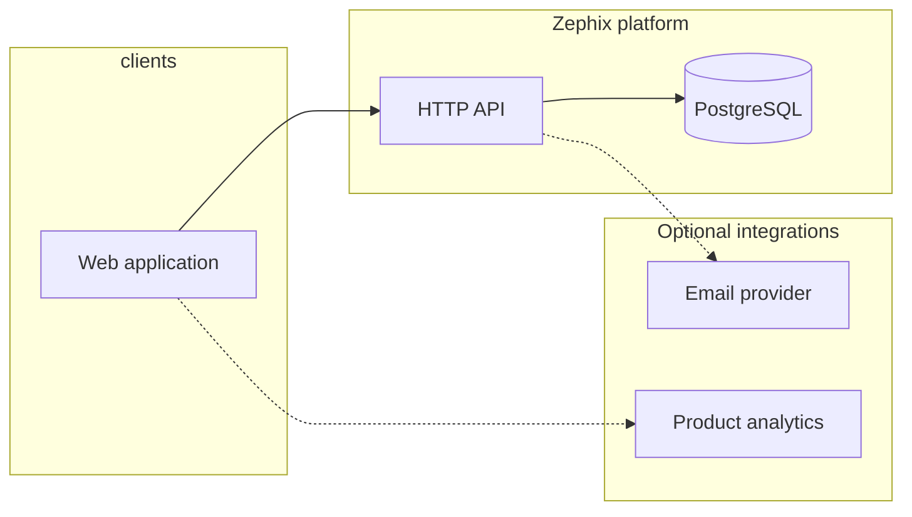

# Zephix — Platform Architecture Overview (Shareable)

**Audience:** Prospective **Solution / Enterprise Architect** candidates  
**Classification:** Non-confidential overview — **contains no credentials, keys, connection strings, or production endpoints**  
**Scope:** Current platform shape as of document date; implementation details live in the private repository.

---

## 1. What Zephix Is

Zephix is a **multi-tenant B2B platform** for **project and work management** inside **organizations** and **workspaces**. It targets **governed execution** (methodology-neutral core data with room for policy-driven behavior), not a lightweight personal task list.

**Primary users:** Enterprise teams coordinating **projects**, **phases**, **tasks**, **dependencies**, **schedules**, **risks**, **capacity**, **KPIs**, and **templates**—with **role-based access** at organization and workspace levels.

---

## 2. System Context

- **Clients:** Single-page **web app** (desktop-first operational UX).  
- **Core services:** **API** over HTTPS; **relational database** as system of record.  
- **Integrations:** Pluggable providers (e.g. transactional email); no secrets named in this document.

---

## 3. Technology Stack (High Level)

| Layer | Choices |
|--------|---------|
| **Backend** | Node.js (LTS), **NestJS**, **TypeORM**, **PostgreSQL** |
| **Frontend** | **React**, **TypeScript**, **Vite**, **Tailwind CSS** |
| **State & data fetching** | Client stores + **TanStack Query** (typical pattern) |
| **Auth** | **JWT** access pattern; refresh/session behavior is **server-tracked** (no stateless refresh as source of truth) |
| **Testing** | **Jest** (backend), **Vitest** (frontend), **Playwright** (e2e) — depth varies by area |
| **Hosting** | Cloud-friendly **Node** + **managed Postgres**; exact vendor is an operational detail |

---

## 4. Logical Architecture

### 4.1 Backend (modular monolith)

- **Modular NestJS** application: domain areas (e.g. **auth**, **organizations**, **workspaces**, **projects**, **work management**, **templates**, **dashboards**, **billing/entitlements** where applicable) are separated by **module boundaries**.
- **HTTP controllers** stay thin; **services** own business rules.
- **Migrations** manage schema evolution; idempotent patterns are preferred for safe rollout.
- **Responses** use **structured error codes** and **DTOs** rather than exposing raw persistence models.

### 4.2 Frontend (feature-oriented SPA)

- **Route-driven** shell: workspace context, project context, and administration surfaces.
- **Feature modules** align to domains (projects, work items, templates, settings).
- **API client** centralizes auth headers, CSRF for mutating requests, and workspace scoping headers where required.

### 4.3 Data

- **PostgreSQL** as the **authoritative store** for tenants, workspaces, projects, work items, templates, and related metadata.
- **JSONB** used selectively for flexible metadata (e.g. template structure, settings blobs) with typed handling at the application layer.

---

## 5. Tenancy & Security Model (Architecturally Critical)

These are **non-negotiable platform rules** for any design review:

| Concept | Rule |
|---------|------|
| **Organization** | Primary **governance and billing boundary**; all data access is scoped by **organization**. |
| **Workspace** | Primary **operational container** for projects and work; workspace-scoped endpoints require validated **workspace context** (not inferred from untrusted client input alone). |
| **Roles** | **Platform roles** (e.g. Admin / Member / Viewer) and **workspace roles** combine to authorize actions; **VIEWER** is treated as read-heavy / guest-like for aggregates. |
| **Cross-workspace** | **Members and viewers** must not receive cross-workspace aggregates unless explicitly scoped to **accessible workspace IDs**. |
| **Client trust** | **Organization ID** and **workspace ID** are **not** taken from arbitrary client bodies for authorization decisions when the server can derive them from auth + route + headers. |
| **Mutations** | State-changing requests expect **CSRF** protection in standard flows. |

**AI / automation (product stance):** Capabilities are **advisory** unless explicitly designed otherwise; no silent autonomous mutations through AI paths.

---

## 6. Major Domain Areas (Bounded Contexts)

Descriptions are **functional**, not exhaustive API listings:

- **Identity & sessions:** Sign-in, tokens, session lifecycle, org membership.
- **Organizations & settings:** Org profile, org-level configuration blobs, security-related settings where implemented.
- **Workspaces & membership:** Workspace lifecycle, members, roles, invitations.
- **Projects:** Project metadata, lifecycle, linkage to workspace and org.
- **Work management:** **Phases**, **tasks**, **subtasks** (hierarchy), **status**, **assignments**, **dates**, **dependencies**, **comments/activity** (as implemented), multiple **views** (e.g. list/table, board, plan/Gantt) backed by the same underlying work graph where possible.
- **Templates:** System and tenant/workspace templates; **instantiation** creates projects from structured definitions; **template center** UX lists published templates with feature-flag or policy-aware behavior.
- **Dashboards & analytics widgets:** Configurable surfaces (maturity varies by area).
- **Policies (evolving):** Hierarchical **policy overrides** (org / workspace / project) exist as a substrate for future **governance rules**; full “governance engine” UX may be phased.

---

## 7. API & Contract Style

- **REST-style** JSON over HTTPS under a stable `/api` prefix (exact routing is internal).
- **Workspace-scoped** routes require an explicit **workspace header** where the contract demands it.
- **Naming:** Persistence often uses **snake_case** columns; the API layer uses **DTOs** and consistent serialization conventions (camelCase on the wire is a common frontend expectation—exact mapping is an implementation detail).
- **Versioning:** Breaking changes are avoided where possible; new flows may be introduced alongside legacy paths during transition (e.g. template instantiation variants).

---

## 8. Delivery, Environments & Quality

- **Monorepo** with separate **backend** and **frontend** packages.
- **CI** runs install, build, lint (with staged/gating strategies), and tests; exact job graph is internal.
- **Environments:** Local dev, staging, production—**secrets and URLs are environment-specific** and not part of this document.
- **Release:** Promotion discipline is **staging-first**; production promotion is controlled.

---

## 9. What This Document Deliberately Omits

To protect the business and comply with safe sharing:

- No **repository URLs**, **hostnames**, **API keys**, **JWT secrets**, **database connection strings**, or **third-party account identifiers**.
- No **customer names**, **payload dumps**, or **unredacted logs**.
- No **commitment** to roadmap dates or unreleased features beyond “evolving governance / templates / views.”

Candidates under consideration may receive **NDA-gated** access to deeper diagrams, ADRs, and the codebase after a formal step.

---

## 10. Questions a Good Architect Should Ask Us

Use these as interview prompts (we are happy to answer under NDA):

1. Where is **workspace context** enforced end-to-end (gateway, guard, service)?  
2. How do **template instantiation** and **project defaults** interact with **governance flags**?  
3. What is the **caching and invalidation** story for work-item aggregates?  
4. How are **migrations** tested for **idempotency** and **rollback**?  
5. What are the **largest coupling risks** between modules today, and the preferred **refactor seams**?

---

## Document control

| Field | Value |
|--------|--------|
| **Purpose** | External / candidate sharing (no secrets) |
| **Owner** | Platform engineering |
| **Update** | Revise when stack or tenancy model materially changes |

**Related (internal):** [RBAC & access control (full reference)](./RBAC_AND_ACCESS_CONTROL_ARCHITECTURE.md) — platform vs workspace roles, guards, matrices, ADR hooks.

---

*End of document.*
